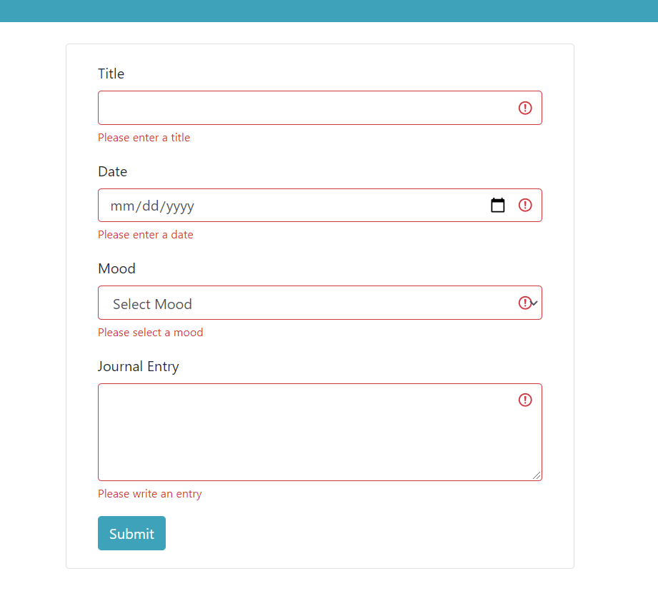

# Daily Journal

_A journal app incorporating the technologies I've learned along my coding journey._

## App Features

- Fullstack App
- Frontend coded with React and JavaScript
  - Use of React Framework React-Bootstrap for styling
- Backend coded with .NET and C#
- SQL database
- Full CRUD functionality

## Screenshots

# History

## May 2021

DailyJournal now has client side validation for its form! I also refactored the code to use the useReducer hook instead of useState for the form data. The client side validation works by checking if the user has clicked away from the input field and if the input value is invalid. If those two conditions are met, then a little red validation message pops up under the input. I feel more comfortable working with the useReducer hook now.

## March 2021

DailyJournal is now a fullstack app! The backend is coded with .NET, database with SQL, and frontend with React & React-Bootstrap.

Ideas for future updates include: image upload capabilities, general code cleanup and improvements, user accounts and authorization with Google Firebase, TypeScript, and client side validation.

## December 2020

This journal started while I was in school. Originally it was all hardcoded HTML, then the entries were moved to a JSON file, and then CRUD functionality was added with JavaScript.

Currently I am in the process of converting this journal into a fullstack application with SQL, C#, .NET, and React.

## July 2020

A daily journal made with the concepts learned in class.

Concepts include: HTML, CSS, JavaScript, JSON, modular code, CRUD functionality, array methods, object methods
